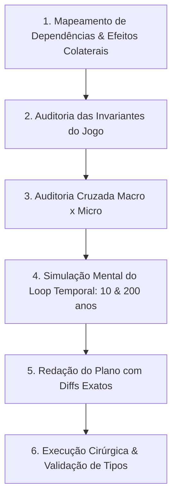
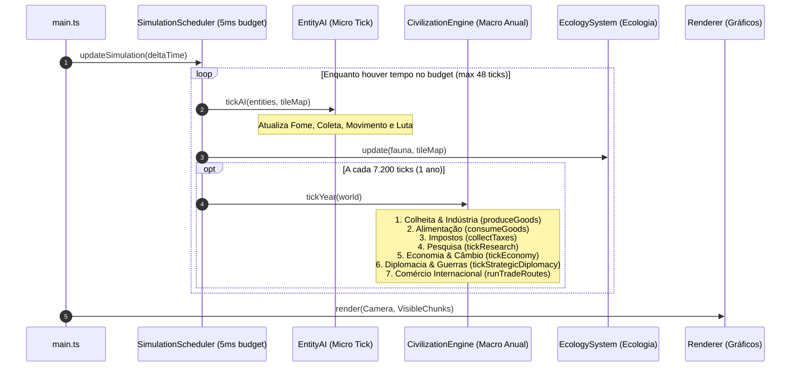
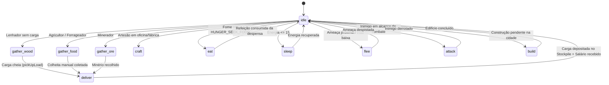

# 🌌 AETHERIO — Enciclopédia Suprema de Arquitetura, Protocolo e Desenvolvimento

> **God-Sandbox-2D (Aetherio)** é uma simulação viva e profunda de civilizações, ecologia, economia e geopolítica em 2D.  
> Este documento é o **manual definitivo**, o **guia de referência técnica** e o **protocolo de execução obrigatório** para qualquer alteração no código.

---

## 📑 ÍNDICE GERAL

1. [🛑 1. Protocolo Obrigatório de Pré-Implementação (6 Etapas)](#protocolo)
2. [⏱️ 2. Constantes Globais, Escalas Temporais & Fórmulas Matemáticas](#constantes-formulas)
3. [🗂️ 3. Catálogo Completo da Base de Código (Todos os Arquivos)](#catalogo-arquivos)
4. [🔄 4. Diagramas de Arquitetura dos Subsistemas](#diagramas-arquitetura)
5. [🤖 5. Máquina de Estados de Entidades & IA Individual](#maquina-estados)
6. [📦 6. Matriz de Cadeias de Suprimentos e Manufatura](#cadeia-suprimentos)
7. [👑 7. Sistema de Governos, Leis & Facções Sociais](#governos-leis-sociedade)
8. [🎨 8. Pipeline de Renderização, Gráficos & Sprites](#pipeline-renderizacao)
9. [💾 9. Sistema de Salvamento & Serialização Segura](#salvamento-serializacao)
10. [📖 10. Manuais Práticos: "Como Mexer no Jogo"](#manuais-praticos)
11. [⚠️ 11. Armadilhas Conhecidas, Invariantes & Guia de Depuração](#armadilhas-debug)

---

<a id="protocolo"></a>
## 🛑 1. PROTOCOLO OBRIGATÓRIO DE PRÉ-IMPLEMENTAÇÃO (6 ETAPAS)

Antes de alterar qualquer código, o desenvolvedor/agente **DEVE** seguir este checklist:



### Etapa 1: Mapeamento de Dependências
- Identifique todos os arquivos que leem ou modificam as variáveis que você pretende alterar.
- Verifique impactos em: **Serialização (`SaveSystem.ts`)**, **Interface (`ui/`)**, **Renderização (`Renderer.ts`)**, **Eventos (`EventBus.ts`)** e **Métricas Históricas (`Chronicle.ts`)**.

### Etapa 2: Auditoria das Invariantes do Jogo
- **Conservação de Massa/Recursos:** O código cria recursos ou dinheiro do nada? Todo ganho tem uma contrapartida de débito real?
- **Sincronia Cambial:** Valores monetários mundiais foram convertidos para a moeda local usando `kingdom.economy.fromWorldValue()` / `toWorldValue()`?
- **Isolamento de Performance:** Não coloque loops pesados ($O(N^2)$, buscas de caminho de longa distância, cálculos de distância em matriz) dentro do loop de frame (`tickAI`).
- **Resiliência a Nulos e Destruição:** Entidades físicas em `deliver`, `eat` ou `craft` tratam com segurança o caso de o edifício ou cidade ter sido destruído?

### Etapa 3: Auditoria Cruzada Macro (CivilizationEngine) vs Micro (EntityAI)
- O jogo possui duas frequências operacionais:
  - **Macro Anual:** `CivilizationEngine` roda 1 vez a cada $7.200$ ticks ($1\text{ ano}$). Processa colheitas em lote, impostos, crescimento populacional e diplomacia.
  - **Micro Contínuo:** `EntityAI` roda a cada tick. Cidadãos andam, cortam lenha, comem da despensa e combatem.
- **Regra de Ouro:** Toda extração/consumo feito no micro deve ser amortizado no macro para evitar dupla contagem.

### Etapa 4: Simulação Mental do Loop Temporal
- O que acontece após **10 anos** simulados?
- O que acontece após **200 anos**? Há risco de hiperinflação, juros infinitos, exaustão biológica total ou travamento populacional?

### Etapa 5: Redação do Plano de Modificação
- Apresente o plano com referências de arquivo, linha e diffs exatos antes de executar.

### Etapa 6: Execução Cirúrgica & Validação de Compilação
- Aplique as alterações e valide com checagem rigorosa de tipos TypeScript (`npm run build`).

---

<a id="constantes-formulas"></a>
## ⏱️ 2. CONSTANTES GLOBAIS, ESCALAS TEMPORAIS & FÓRMULAS MATEMÁTICAS

### ⏰ Cadência Temporal do Motor
```typescript
TICKS_PER_YEAR = 7200;      // 1 ano completo de simulação
TICKS_PER_DAY = 600;        // 1 dia de simulação (12 dias por ano)
DAYS_PER_YEAR = 12;
SIMULATION_BUDGET_MS = 5;   // Orçamento máximo de CPU por frame
MAX_TICKS_PER_FRAME = 48;   // Limite de catch-up de simulação
```

### 📐 Fórmulas Matemáticas Fundamentais

#### 1. Lastro e Cotação da Moeda Real (`Economy.ts`)
$$\text{backing} = \frac{\text{goldReserves} \times 6 + \text{GDP}}{\max(1, \text{currency.supply})}$$
$$\text{targetValue} = \text{clamp}(\text{backing}, 0.15, 4.0)$$
$$\text{currency.value} \mathrel{+}= (\text{targetValue} - \text{currency.value}) \times 0.2$$
$$\text{inflation} = \frac{\text{previousValue} - \text{currentValue}}{\text{previousValue}}$$

#### 2. Mecânica do Mercado Mundial de Preços (`WorldMarket`)
$$\text{scarcityRatio} = \frac{\text{demand} + 1}{\text{supply} + 1}$$
$$\text{ceiling} = \text{strategic} \ ? \ 5.5 : 3.5$$
$$\text{targetPrice} = \text{basePrice} \times \max\left(0.35, \min\left(\text{ceiling}, \text{scarcityRatio}^{0.6}\right)\right)$$
$$\text{price} \mathrel{+}= (\text{targetPrice} - \text{price}) \times 0.25$$

#### 3. Cálculo de Poder Militar Combinado (`Kingdom.computePower`)
$$\text{Base} = \text{Pop} \times 2 + \text{Território} \times 0.6 + \text{Cidades} \times 25$$
$$\text{Coesão} = 0.72 + \text{Legitimidade} \times 0.18 + \text{AlcanceAdmin} \times 0.18$$
$$\text{Exaustão} = \max(0.65, 1 - \text{WarWeariness} \times 0.0025)$$
$$\text{CulturaGuerra} = 0.9 + \text{Militarismo} \times 0.15 + \text{Autoridade} \times 0.08 - \text{Trauma} \times 0.09$$
$$\text{Poder} = \text{Base} \times \text{ModTech} \times \text{GovMil} \times \text{Coesão} \times \text{Exaustão} \times \text{CulturaGuerra} \times \text{MobilizaçãoSocial} \times \text{LeiMil}$$

#### 4. Resolução de Dano de Combate (`EntityAI.ts`)
$$\text{DanoBase} = \text{Atacante.Damage} + \text{Arma.DamageBonus} - \text{Defensor.Defense}$$
$$\text{DanoFinal} = \max(5, \text{DanoBase})$$

---

<a id="catalogo-arquivos"></a>
## 🗂️ 3. CATÁLOGO COMPLETO DA BASE DE CÓDIGO (TODOS OS ARQUIVOS)

```
god-sandbox-2d/
├── src/
│   ├── civ/                  # Motores de Civilização, Economia e Geopolítica
│   │   ├── ArchitecturalProfile.ts # Perfis arquitetônicos e estilos de cidade
│   │   ├── Building.ts             # Definições, custos e categorias de edifícios
│   │   ├── CaravanSystem.ts        # Caravanas terrestres e desgaste de estradas
│   │   ├── Chronicle.ts            # Registro de história e eventos cronológicos
│   │   ├── City.ts                 # Assentamento, tiers urbanos e Stockpile municipal
│   │   ├── CivilizationEngine.ts   # MOTOR MESTRE: Ticks anuais, produção, taxas, diplomacia
│   │   ├── CulturalIdentity.ts     # Identidades étnicas e estéticas
│   │   ├── Culture.ts              # Eixos culturais (Tradição, Militarismo, Coletivismo)
│   │   ├── Diplomacy.ts            # Matriz de relações, guerras, alianças e tréguas
│   │   ├── Economy.ts              # WorldMarket, LocalMarket, Moeda, PIB e Câmbio
│   │   ├── FortificationPlanner.ts # Traçado de muralhas e anéis defensivos
│   │   ├── Generations.ts          # Sucessão genealógica, testamentos e herança
│   │   ├── Goods.ts                # Catálogo de 25 bens, receitas de forja e Stockpile
│   │   ├── Government.ts           # Formas de governo (Monarquia, República, Império, etc.)
│   │   ├── GreatPersons.ts         # Grandes Personalidades históricas e feitos
│   │   ├── Household.ts            # Família econômica, despensa doméstica e carteira
│   │   ├── Infrastructure.ts       # Fatores de transporte, pontes e rodovias
│   │   ├── Kingdom.ts              # Estrutura do reino, cálculo de poder e tesouro
│   │   ├── Laws.ts                 # 27 Leis em 9 categorias com apoio de facções
│   │   ├── Lineage.ts              # Árvores genealógicas e linhagens reais
│   │   ├── MilitaryLogistics.ts    # Linhas de suprimento e logística militar
│   │   ├── NavalSystem.ts          # Navios, rotas marítimas e combustível
│   │   ├── RailwayNetwork.ts       # Malha ferroviária, trens a vapor e frete de aço
│   │   ├── RoadEngineering.ts      # Engenharia de pontes e pavimentação
│   │   ├── SaveSystem.ts           # Serialização do estado civilizacional
│   │   ├── Society.ts              # 6 Facções sociais, descontentamento e risco de golpe
│   │   ├── TechTree.ts             # Árvore tecnológica dividida em 7 eras
│   │   ├── Trade.ts                # Acordos comerciais, tarifas e embargos
│   │   ├── UrbanDistricts.ts       # Distritos urbanos emergentes (Comercial, Residencial, etc.)
│   │   ├── UrbanLifecycle.ts       # Degradação, incêndios e reconstrução urbana
│   │   ├── UrbanPlanner.ts         # IA de planejamento de lotes (scoreBuilding)
│   │   ├── WarFronts.ts            # Frentes de batalha geográficas e pontos de atrito
│   │   └── Warfare.ts              # Regimentos, companhias de mercenários e cercos
│   ├── ai/                   # Inteligência Artificial em Tempo Real
│   │   ├── EntityAI.ts             # Máquina de estados das entidades (micro tick)
│   │   └── Pathfinding.ts          # Algoritmo A* bidirecional para grade 2D
│   ├── entities/             # Atributos e Estrutura de Seres Vivos
│   │   ├── Entity.ts               # Estrutura base de humano, soldado ou animal
│   │   ├── Equipment.ts            # Armas, armaduras e ferramentas físicas
│   │   ├── Identity.ts             # Nomes procedurais, gênero e títulos
│   │   ├── Needs.ts                # Fome, energia, sanidade e segurança
│   │   ├── Psyche.ts               # Traumas de combate, rancores e ambições
│   │   ├── Species.ts              # Atributos de espécies (Humanos, Elfos, Anões, Orcs, etc.)
│   │   └── Traits.ts               # Traços genéticos e de personalidade
│   ├── world/                # Terreno, Biomas, Mapas e Clima
│   │   ├── Biomes.ts               # Tipos de terreno e biomas (Planície, Deserto, Tundra)
│   │   ├── CompactTerritory.ts     # Estrutura bitset compacta de fronteiras
│   │   ├── Deposits.ts             # Veios minerais esgotáveis no subsolo
│   │   ├── Noise.ts                # Simplex Noise procedural para relevo
│   │   ├── RoadTerrain.ts          # Níveis de estrada nos azulejos (0 a 3)
│   │   ├── Tile.ts                 # Estrutura de dados do azulejo
│   │   ├── TileMap.ts              # Matriz global do mapa e caches
│   │   ├── WeatherEras.ts          # Eras climáticas (Era do Gelo, Seca, etc.)
│   │   ├── WorldBlueprints.ts      # Blueprints de geração do mundo
│   │   ├── WorldChunks.ts          # Divisão do mapa em chunks espaciais
│   │   └── WorldGenerator.ts       # Gerador procedural de continentes e rios
│   ├── ecology/              # Cadeia Alimentar e Fauna
│   │   └── EcologySystem.ts        # Populações selvagens, caça e reprodução
│   ├── powers/               # Poderes Divinos e Desastres
│   │   ├── BrushManager.ts         # Gerenciamento de pincéis do jogador
│   │   ├── Disasters.ts            # Raios, meteoros, incêndios e terremotos
│   │   └── GodPowers.ts            # Spawn de vida, bênçãos e terraformação
│   ├── renderer/             # Pipeline Gráfico e Sprites
│   │   ├── Camera.ts               # Câmera, zoom e conversão de tela
│   │   ├── Renderer.ts             # Renderizador Canvas 2D/WebGPU com culling
│   │   ├── SpriteGenerator.ts      # Gerador procedural de pixel-art
│   │   ├── SpriteRegistry.ts       # Registro e cache de sprites
│   │   └── TerrainPalette.ts       # Paletas de cores e texturas por bioma
│   ├── ui/                   # Interface do Usuário (HUD, Telas, Inspetores)
│   │   ├── screens/EconomyScreen.ts # Tela mestre de economia e finanças
│   │   └── ...                     # Inspetores de Cidades, Reinos, Exércitos, Leis
│   ├── core/                 # Infraestrutura, Eventos e Persistência
│   │   ├── EventBus.ts             # Barramento central de eventos desacoplados
│   │   ├── ObjectPool.ts           # Pool de objetos para reaproveitamento de memória
│   │   ├── Random.ts               # Gerador pseudo-aleatório com sementes
│   │   ├── SaveSystem.ts           # Sistema unificado de salvamento JSON
│   │   └── SpatialHash.ts          # Aceleração espacial para consultas de proximidade
│   └── main.ts               # Ponto de entrada, agendador e loop do jogo
```

---

<a id="diagramas-arquitetura"></a>
## 🔄 4. DIAGRAMAS DE ARQUITETURA DOS SUBSISTEMAS

### Diagrama 1: Loop de Execução e Ordem dos Ticks


---

### Diagrama 2: Ciclo Econômico Completo (Da Terra ao Tesouro)
```mermaid
graph TD
    subgraph "1. Natureza & Extração"
        D[(Veio Mineral)] -->|Mina / Pedreira| RAW[Minérios: Ferro, Carvão, Cobre]
        F[(Campos Agrícolas)] -->|Fazenda / Pasto| STAPLE[Comida, Algodão, Cavalos]
    end

    subgraph "2. Armazenamento & Manufatura"
        RAW --> STOCK[Stockpile Municipal da Cidade]
        STAPLE --> STOCK
        STOCK -->|Receitas de Transformação| CRAFT[Forjas, Oficinas, Fábricas, Refinarias]
        CRAFT -->|Aço, Ferramentas, Tecido, Combustível| STOCK
    end

    subgraph "3. Consumo Local & Famílias"
        STOCK -->|Compra Diária| HH[Despensa Familiar (Household)]
        HH -->|Alimenta Cidadão| CIT[Entidade Cidadã]
        CIT -->|Trabalha & Produz| CRAFT
    end

    subgraph "4. Coroa & Comércio Exterior"
        STOCK -->|Imposto em Espécie| CROWN[Tesouro Real do Reino]
        STOCK -->|Excedentes Vendidos| ROUTE[Rotas Comerciais Terrestres/Marítimas]
        ROUTE -->|Receita em Moeda| CROWN
        CROWN -->|Lastro de Ouro & PIB| MINT[Câmbio da Moeda & Mercado Mundial]
    end
```

---

<a id="maquina-estados"></a>
## 🤖 5. MÁQUINA DE ESTADOS DE ENTIDADES & IA INDIVIDUAL

Toda entidade humanoide ou criatura opera sob uma máquina de estados finitos em [`EntityAI.ts`](file:///c:/Users/ryan/.gemini/antigravity/scratch/god-sandbox-2d/src/ai/EntityAI.ts):



### Tabela de Estados Principais (`EntityAI.ts`)
| Estado | Gatilho de Entrada | Comportamento no Tick | Transição de Saída |
| :--- | :--- | :--- | :--- |
| `idle` | Sem tarefa urgente | Avalia necessidades vitais (fome, sono) e profissão | Muda para `eat`, `sleep` ou estado de trabalho |
| `gather_wood` | Profissão `woodcutter` ou forrageador | Move até árvore, retira madeira do azulejo | Muda para `deliver` quando coleta carga |
| `gather_food` | Profissão `farmer` ou fome | Move até campo/arbusto | Muda para `deliver` ou come na hora se sem lar |
| `gather_ore` | Profissão `miner` | Move até mina/depósito mineral | Muda para `deliver` |
| `deliver` | Entidade com carga (`e.carrying != null`) | Move até a Prefeitura (`town_center`) da cidade | Deposita material no `city.stock`, ganha salário e vai para `idle` |
| `craft` | Profissão `builder` alocada em oficina/forja | Anima no balcão de trabalho, consome energia | Permanece até descanso |
| `eat` | Fome crítica ($\ge 45$) | Move até a casa (`homeBuilding`), retira porção da despensa familiar | Reduz fome, restaura energia e vai para `idle` |
| `attack` | Inimigo hostil detectado no raio de visão | Fecha distância e desfere golpes a cada cooldown | Mata o alvo ou foge se HP ficar crítico |
| `flee` | HP $< 25\%$ ou ameaça esmagadora | Corre na direção oposta ao agressor | Volta a `idle` ao atingir distância segura |

---

<a id="cadeia-suprimentos"></a>
## 📦 6. MATRIZ DE CADEIAS DE SUPRIMENTOS E MANUFATURA

### Tabela de Bens e Conversões (`Goods.ts`)
| ID do Bem | Categoria | Tier | Preço Base | Extraído Por | Manufaturado Em | Receita de Produção (Insumos $\rightarrow$ Saída) |
| :--- | :---: | :---: | :---: | :--- | :--- | :--- |
| `food` | raw | common | 2 | Fazenda / Pasto / Forragem | — | — |
| `wood` | raw | common | 3 | Acampamento Madeireiro | — | — |
| `stone` | raw | common | 4 | Pedreira | — | — |
| `clay` | raw | common | 3 | Pedreira | — | — |
| `copper` | raw | regional | 11 | Mina | — | — |
| `tin` | raw | strategic | 26 | Mina | — | — |
| `iron` | raw | regional | 9 | Mina | — | — |
| `coal` | raw | regional | 8 | Mina | — | — |
| `gold` | raw | regional | 28 | Mina | — | — |
| `oil` | raw | strategic | 55 | Poço de Petróleo | — | — |
| `saltpeter` | raw | strategic | 34 | Mina | — | — |
| `rubber` | raw | strategic | 42 | Silvicultura Tropical | — | — |
| `uranium` | raw | strategic | 120 | Mina Profunda | — | — |
| `bronze` | crafted | regional | 30 | — | Forja (`smithy`) | 3 Cobre + 1 Estanho $\rightarrow$ **2.4 Bronze** |
| `steel` | crafted | regional | 40 | — | Forja (`smithy`) | 3 Ferro + 2 Carvão $\rightarrow$ **1.5 Aço** |
| `tools` | crafted | common | 24 | — | Forja (`smithy`) | 1 Aço + 1 Madeira $\rightarrow$ **2.3 Ferramentas** |
| `cloth` | crafted | common | 15 | — | Oficina (`workshop`) | 2 Algodão $\rightarrow$ **1.4 Tecido** |
| `fuel` | crafted | strategic | 70 | — | Refinaria (`refinery`) | 2 Petróleo $\rightarrow$ **1.8 Combustível** |
| `gunpowder` | crafted | strategic | 58 | — | Forja (`smithy`) | 2 Salitre + 1 Carvão $\rightarrow$ **1.8 Pólvora** |
| `machinery` | crafted | strategic | 95 | — | Fábrica (`factory`) | 3 Aço + 1 Borracha + 1 Combustível $\rightarrow$ **3.4 Maquinário** |

---

<a id="governos-leis-sociedade"></a>
## 👑 7. SISTEMA DE GOVERNOS, LEIS & FACÇÕES SOCIAIS

### Formas de Governo (`Government.ts`)
| Governo | Estabilidade | Multiplicador Militar | Arrecadação Fiscal | Modelo Econômico |
| :--- | :---: | :---: | :---: | :---: |
| `monarchy` | 0.65 | 1.15 | 0.22 | Misto |
| `republic` | 0.70 | 0.95 | 0.18 | Mercado |
| `theocracy` | 0.75 | 1.10 | 0.25 | Planejado |
| `empire` | 0.60 | 1.35 | 0.28 | Misto |
| `communist_state` | 0.68 | 1.20 | 0.32 | Planejado |
| `federation` | 0.80 | 1.00 | 0.16 | Mercado |

### As 6 Facções Sociais (`Society.ts`)
1. **Nobres (`nobles`):** Exigem altos privilégios agrários e impostos baixos sobre propriedades.
2. **Clero & Intelectuais (`clergy_scholars`):** Focam em templos, bibliotecas, tradição e moral.
3. **Mercadores (`merchants`):** Exigem livre comércio, portos, estradas e tarifas baixas.
4. **Camponeses (`peasants`):** Querem terras comuns, subsistência e proteção contra fome.
5. **Operários (`workers`):** Exigem direitos trabalhistas em fábricas e salários justos.
6. **Militares (`military`):** Pressionam por gastos marciais, quartéis e campanhas expansionistas.

---

<a id="pipeline-renderizacao"></a>
## 🎨 8. PIPELINE DE RENDERIZAÇÃO, GRÁFICOS & SPRITES

O renderizador ([`Renderer.ts`](file:///c:/Users/ryan/.gemini/antigravity/scratch/god-sandbox-2d/src/renderer/Renderer.ts)) desenha a cena seguindo uma ordem de camadas rigorosa:

```
[Camada 0: Base do Terreno & Água]
  └── Azulejos de Bioma, Elevação e Costa
[Camada 1: Malha de Estradas & Trilhos]
  └── Trilhas de Terra, Estradas de Pedra, Rodovias Imperiais, Ferrovias
[Camada 2: Bordas de Território & Zonas]
  └── Linhas de fronteira de reinos e distritos municipais
[Camada 3: Edifícios & Estruturas Físicas]
  └── Casas, Fazendas, Muralhas, Portões, Torres, Fábricas
[Camada 4: Sombras Projetadas]
  └── Sombras dinâmicas calculadas pelo ângulo do sol
[Camada 5: Entidades Vivas & Veículos]
  └── Humanos, Soldados, Animais Selvagens, Caravanas, Trens, Navios
[Camada 6: Projéteis & Armas em Voo]
  └── Flechas, Lanças, Balas de Canhão, Balísticas
[Camada 7: Efeitos de Partículas & Clima]
  └── Fumaça, Fogo, Poeira, Chuva, Neve, Ondas
[Camada 8: Overlays de Informação & HUD]
  └── Nomes de Cidades, Barras de Vida, Ícones de Emote, Mini-mapa
```

---

<a id="salvamento-serializacao"></a>
## 💾 9. SISTEMA DE SALVAMENTO & SERIALIZAÇÃO SEGURA

O sistema de salvamento ([`SaveSystem.ts`](file:///c:/Users/ryan/.gemini/antigravity/scratch/god-sandbox-2d/src/core/SaveSystem.ts)) empacota todo o universo em formato JSON estruturado.

### Checklist Obrigatório de Serialização ao Modificar Classes:
1. **Todo novo campo adicionado a uma classe DEVE estar no método `serialize()`**.
2. **Todo novo campo DEVE ter um valor padrão seguro no método `deserialize()`** (usando fallback `?? defaultValue`), garantindo retrocompatibilidade com saves antigos.
3. **Coleções (`Map` e `Set`) devem ser convertidas para arrays ou objetos planos** durante a serialização e reconstruídas no `deserialize()`.

---

<a id="manuais-praticos"></a>
## 📖 10. MANUAIS PRÁTICOS: "COMO MEXER NO JOGO"

### 🔨 Manual 1: Como Adicionar um Novo Edifício
1. Abra [`Building.ts`](file:///c:/Users/ryan/.gemini/antigravity/scratch/god-sandbox-2d/src/civ/Building.ts):
   - Adicione o nome no tipo `BuildingType`.
   - Adicione a definição em `BUILDINGS` com custo, empregos (`jobs`), categoria (`food`, `extraction`, `craft`, `knowledge`, `power`, `commerce`), capacidade e durabilidade (`maxHp`).
2. Abra [`SpriteRegistry.ts`](file:///c:/Users/ryan/.gemini/antigravity/scratch/god-sandbox-2d/src/renderer/SpriteRegistry.ts):
   - Registre o sprite ou gerador pixel-art do edifício.
3. Abra [`UrbanPlanner.ts`](file:///c:/Users/ryan/.gemini/antigravity/scratch/god-sandbox-2d/src/civ/UrbanPlanner.ts):
   - Adicione a pontuação de prioridade em `scoreBuilding()` para que os prefeitos saibam quando construir o prédio.
4. Abra [`CivilizationEngine.ts`](file:///c:/Users/ryan/.gemini/antigravity/scratch/god-sandbox-2d/src/civ/CivilizationEngine.ts):
   - Se o edifício processa receitas ou extrai minérios, configure em `produceGoods` ou `runCraftProduction`.

---

### 🔬 Manual 2: Como Adicionar uma Nova Tecnologia
1. Abra [`TechTree.ts`](file:///c:/Users/ryan/.gemini/antigravity/scratch/god-sandbox-2d/src/civ/TechTree.ts):
   - Adicione o identificador em `TechId`.
   - Configure a era (`era`), custo de ciência (`cost`), pré-requisitos (`requires`) e o que desbloqueia (`unlocks: { buildings, features, modifiers }`).
2. Abra [`CivilizationEngine.ts`](file:///c:/Users/ryan/.gemini/antigravity/scratch/god-sandbox-2d/src/civ/CivilizationEngine.ts):
   - Conecte o efeito onde apropriado checando `kingdom.research.knows('minha_tech')` ou `knowsFeature('minha_feature')`.

---

### 🐺 Manual 3: Como Adicionar uma Nova Espécie ou Animal
1. Abra [`Species.ts`](file:///c:/Users/ryan/.gemini/antigravity/scratch/god-sandbox-2d/src/entities/Species.ts):
   - Adicione em `SpeciesType` e configure `SPECIES_DEFINITIONS` com vida, dano, velocidade, biomas preferidos e se é humanoide (`isHumanoid`).
2. Abra [`EntityVisualResolver.ts`](file:///c:/Users/ryan/.gemini/antigravity/scratch/god-sandbox-2d/src/renderer/EntityVisualResolver.ts):
   - Vincule a paleta de cores e modelo visual do sprite.
3. Abra [`EcologySystem.ts`](file:///c:/Users/ryan/.gemini/antigravity/scratch/god-sandbox-2d/src/ecology/EcologySystem.ts) e [`WorldGenerator.ts`](file:///c:/Users/ryan/.gemini/antigravity/scratch/god-sandbox-2d/src/world/WorldGenerator.ts):
   - Adicione ao array de spawn ecológico natural por bioma.

---

### ⚖️ Manual 4: Como Adicionar uma Nova Lei
1. Abra [`Laws.ts`](file:///c:/Users/ryan/.gemini/antigravity/scratch/god-sandbox-2d/src/civ/Laws.ts):
   - Adicione o ID em `LawId` e a definição em `LAWS` (categoria, efeitos numéricos, facções que apoiam e que se opõem).
2. Abra [`Society.ts`](file:///c:/Users/ryan/.gemini/antigravity/scratch/god-sandbox-2d/src/civ/Society.ts):
   - Conecte os efeitos na aprovação de reformas sociais.

---

<a id="armadilhas-debug"></a>
## ⚠️ 11. ARMADILHAS CONHECIDAS, INVARIANTES & GUIA DE DEPURAÇÃO

| Sintoma / Bug Conhecido | Causa Raiz Típica | Solução Obrigatória |
| :--- | :--- | :--- |
| **Dinheiro Criado do Nada** | Venda comercial creditando ouro sem debitar o tesouro do comprador ou bancos produzindo ouro mineral. | Sempre debitar o comprador e converter moeda com `fromWorldValue()`. Bancos devem dar bônus fiscal, não minerar ouro. |
| **Alianças Eternas / Paz Perpétua** | Falta de rotina de dissolução de aliança quando a relação bilateral despenca. | Adicionar checagem anual: se $\text{relação} < 20$, dissolver a aliança formal. |
| **Aliados Entram em Guerra Infinita Pós-Paz** | `settleWar()` registra trégua apenas para os líderes, esquecendo os aliados listados. | Aplicar `recordTruce()` para todos os membros de `attackerAllies` e `defenderAllies`. |
| **Cidadão Preso Andando em Parede** | Pathfinding em linha reta quando o caminho está bloqueado por nova construção. | Checar `pos.blocked` no `EntityAI` e redirecionar a entidade para `idle` ou estado alternativo. |
| **Desaparecimento de Florestas em 3 Anos** | Dupla coleta de madeira (cidadão corta no micro tick e motor colhe a cota cheia no macro anual). | Amortizar a colheita anual descontando o volume já entregue manualmente no ano. |
| **Cidades que Não Constroem Nada** | Pontuação em `scoreBuilding()` retornando negativo ou falta do material de base (pedra/madeira). | Checar se a cidade possui pedreira/madeireiro e garantir que o score base seja positivo. |

---

*Manual Supremo Aetherio — Versão 2.0 Expandida.*
