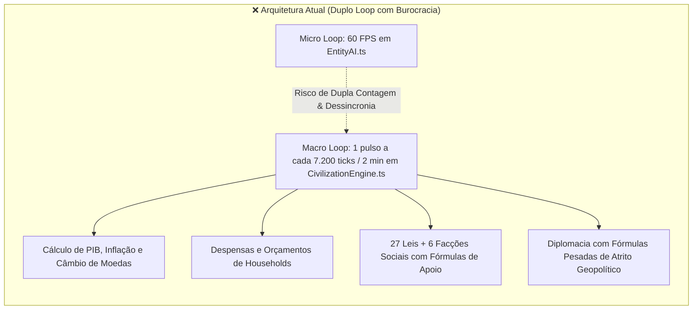
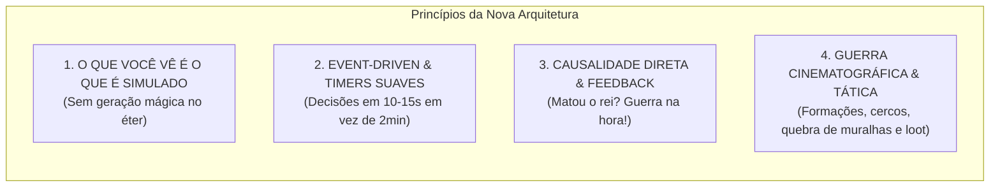
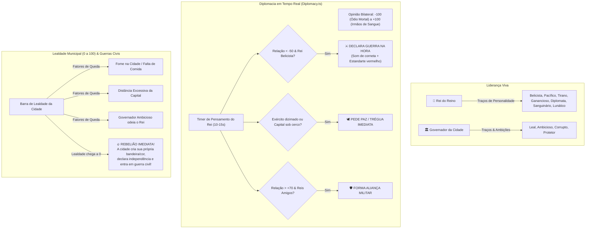
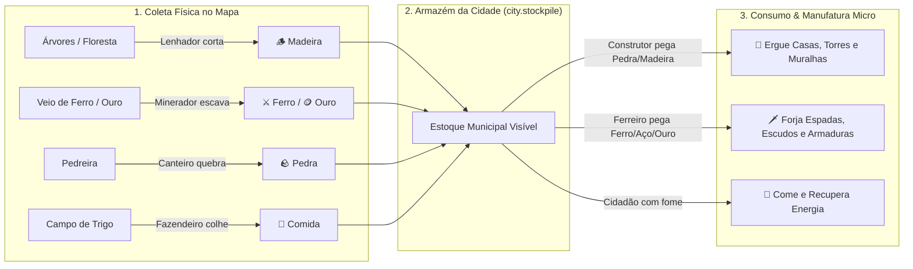
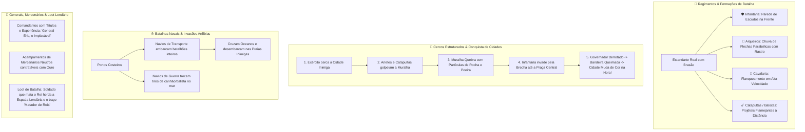
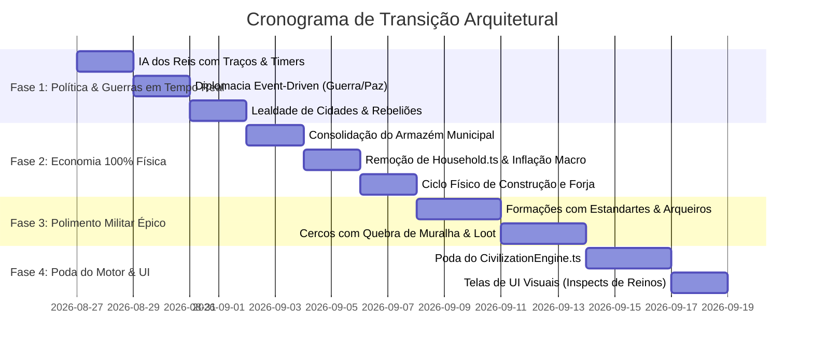

# 🌌 AETHERIO (God-Sandbox-2D) — Documento de Simplificação Arquitetural
## Transição para Simulação Micro em Tempo Real (Estilo WorldBox) com Sistema Militar Épico

> **Status do Documento:** Aprovado para Planejamento & Execução  
> **Data:** Agosto de 2026  
> **Base de Código:** TypeScript / Canvas 2D & WebGPU / Tauri  

---

## 📑 ÍNDICE GERAL

1. [🎯 1. Visão Geral & Motivação da Mudança](#1-visao-geral--motivacao-da-mudanca)
2. [🔍 2. Diagnóstico da Arquitetura Atual (O que está inchado)](#2-diagnostico-da-arquitetura-atual)
3. [✨ 3. A Nova Filosofia de Design (WorldBox Micro-First)](#3-a-nova-filosofia-de-design)
4. [👑 4. Módulo 1: Política, Diplomacia & Rebeliões em Tempo Real](#4-modulo-1-politica-diplomacia--rebelioes-em-tempo-real)
5. [📦 5. Módulo 2: Economia 100% Física & Tangível](#5-modulo-2-economia-100-fisica--tangivel)
6. [⚔️ 6. Módulo 3: O Sistema Militar ÉPICO & Cinematográfico](#6-modulo-3-o-sistema-militar-epico--cinematografico)
7. [⏱️ 7. Módulo 4: Cadência Temporal Unificada & Poda do Motor](#7-modulo-4-cadencia-temporal-unificada--poda-do-motor)
8. [📊 8. Estimativa Quantitativa: Linhas de Código & Performance](#8-estimativa-quantitativa-linhas-de-codigo--performance)
9. [🗺️ 9. Roteiro de Implementação em Fases (Roadmap)](#9-roteiro-de-implementacao-em-fases)

---

<a id="1-visao-geral--motivacao-da-mudanca"></a>
## 🎯 1. VISÃO GERAL & MOTIVAÇÃO DA MUDANÇA

O **Aetherio** nasceu como um simulador de civilizações profundo em 2D. Ao longo do desenvolvimento inicial, o projeto incorporou mecânicas pesadas de *Grand Strategy* (inspiradas em *Victoria 3* e *Europa Universalis*), como câmbio de moedas flutuantes com lastro em ouro, inflação estatística, 27 leis com matrizes parlamentares, 6 facções sociais invisíveis e despensas domésticas microscópicas por família.

### O "Insight" Central do Game Design
Em um **God Sandbox 2D interativo**, o jogador não quer ler planilhas de inflação ou esperar um tick anual de 2 minutos para ver um tratado de paz. A verdadeira diversão e alma do gênero (como demonstrado por *WorldBox*, *RimWorld* e *Dwarf Fortress*) reside na **emergência direta, física e caótica**:

> 💡 *A graça de um God Sandbox é ver um ferreiro forjar uma espada de ouro, matar um urso, virar Rei com o traço 'Tirano', e ver a cidade vizinha se rebelar em guerra civil na mesma hora porque não quer pagar impostos!*

Esta reestruturação preserva toda a rica variedade visual, recursos e biomas do jogo, mas **elimina a burocracia matemática invisível**, unifica a simulação em **tempo real contínuo** e transforma o **sistema militar em um espetáculo tático e cinematográfico**.

---

<a id="2-diagnostico-da-arquitetura-atual"></a>
## 🔍 2. DIAGNÓSTICO DA ARQUITETURA ATUAL



### Principais Problemas Identificados:
1. **Duplo Loop Dessincronizado:** O motor processava colheitas e trabalho no micro (`EntityAI.ts`), mas tentava recalcular quotas e impostos no macro (`CivilizationEngine.ts`), exigindo código complexo de amortização para evitar dupla contagem.
2. **Micro-Stutters Periódicos:** A cada 7.200 ticks (~2 minutos), a simulação congelava por 35–50ms para rodar o balanço macro mundial de uma só vez.
3. **Overhead de Memória:** O sistema `Household.ts` alocava centenas de objetos individuais na memória (despensa, carteira e membros por família), sobrecarregando o Garbage Collector.
4. **Falta de Causalidade Imediata:** Se o jogador usava um Poder Divino (ex: raio que mata o rei), o impacto diplomático e político demorava minutos para ser processado no tick anual.

---

<a id="3-a-nova-filosofia-de-design"></a>
## ✨ 3. A NOVA FILOSOFIA DE DESIGN (WORLDBOX MICRO-FIRST)



* **100% em Tempo Real:** Toda lógica de estado roda distribuída continuamente (frequências de 60Hz, 1Hz e 0.1Hz), eliminando congelamentos.
* **Economia Tangível:** Recursos são físicos — colhidos no mapa, carregados nos braços, estocados nos celeiros da cidade e usados por construtores/ferreiros.
* **Política de Personagens:** Reis e governadores vivos tomam decisões geopolíticas com base em seus traços de personalidade e relacionamentos diretos.

---

<a id="4-modulo-1-politica-diplomacia--rebelioes-em-tempo-real"></a>
## 👑 4. MÓDULO 1: POLÍTICA, DIPLOMACIA & REBELIÕES EM TEMPO REAL

Substituição da burocracia de 27 leis e 6 facções por uma IA de governantes orientada a eventos e personalidades.



### O que é Simplificado / Podado:
* **Remoção de `Laws.ts` complexo:** As 27 leis viram traços simples do Reino/Rei (ex: *Imposto Alto*, *Recrutamento Obrigatório*).
* **Remoção de `Society.ts` abstrato:** As 6 classes sociais são substituídas pela **Lealdade Municipal (0–100)** direta de cada cidade.

---

<a id="5-modulo-2-economia-100-fisica--tangivel"></a>
## 📦 5. MÓDULO 2: ECONOMIA 100% FÍSICA & TANGÍVEL

Preservamos a **rica variedade de recursos** (`Goods.ts`), mas removemos toda matemática financeira invisível.



### Recursos Mantidos no Armazém Municipal:
* **Comuns:** `food` (Alimento), `wood` (Madeira), `stone` (Pedra), `clay` (Argila).
* **Metais & Minérios:** `iron` (Ferro), `copper` (Cobre), `gold` (Ouro), `coal` (Carvão), `gems` (Gemas).
* **Estratégicos & Manufaturados:** `steel` (Aço), `tools` (Ferramentas), `cloth` (Tecido), `gunpowder` (Pólvora).

### O que é Simplificado / Podado:
* **Remoção de `Household.ts`:** Cidadãos leem a fome e comem direto do celeiro municipal ou de casa sem precisar de um objeto de despensa e carteira individual.
* **Remoção de Inflação & PIB em `Economy.ts`:** Elimina cálculo de moedas nominais, índices de preços e lastro cambial. A riqueza é o ouro e os bens no armazém.

---

<a id="6-modulo-3-o-sistema-militar-epico--cinematografico"></a>
## ⚔️ 6. MÓDULO 3: O SISTEMA MILITAR ÉPICO & CINEMATOGRÁFICO

A parte militar é o coração do espetáculo visual do jogo. Mantemos e potencializamos as bases de [`Warfare.ts`](file:///c:/Users/ryan/.gemini/antigravity/scratch/god-sandbox-2d/src/civ/Warfare.ts), [`WarFronts.ts`](file:///c:/Users/ryan/.gemini/antigravity/scratch/god-sandbox-2d/src/civ/WarFronts.ts), [`Warships.ts`](file:///c:/Users/ryan/.gemini/antigravity/scratch/god-sandbox-2d/src/civ/Warships.ts) e [`NavalInvasion.ts`](file:///c:/Users/ryan/.gemini/antigravity/scratch/god-sandbox-2d/src/civ/NavalInvasion.ts):



---

<a id="7-modulo-4-cadencia-temporal-unificada--poda-do-motor"></a>
## ⏱️ 7. MÓDULO 4: CADÊNCIA TEMPORAL UNIFICADA & PODA DO MOTOR

Em vez de um abismo entre o tick de 1 frame e o tick de 2 minutos, o motor opera em **3 frequências suaves e contínuas**:

```
┌─────────────────────────────────────────────────────────────────────────────┐
│ 1. CADÊNCIA MICRO CONTÍNUA (60 Hz — A cada Tick / Frame)                   │
│    • Física de movimento, pathfinding e colisão                              │
│    • Combate corpo a corpo, lançamento e trajetória de flechas/catapultas    │
│    • Coleta física de recursos (madeira, pedra, minério) e partículas       │
├─────────────────────────────────────────────────────────────────────────────┤
│ 2. CADÊNCIA DE VIDA MUNICIPAL (1 Hz — A cada 1 a 2 Segundos)                 │
│    • Consumo de comida pelos cidadãos (alimentação no armazém)              │
│    • Progresso de construção de casas, torres e reparo de muralhas           │
│    • Forja de armas, armaduras e ferramentas pelos artesãos da cidade       │
├─────────────────────────────────────────────────────────────────────────────┤
│ 3. CADÊNCIA GEOPOLÍTICA & DECISÃO DOS REIS (0.1 Hz — A cada 10 a 15 Segundos)│
│    • IA do Rei: avaliar vizinhos, declarar guerra, pedir paz, alianças       │
│    • Verificação de Lealdade das Cidades (0-100) e disparo de Rebeliões     │
│    • Contratação de companhias mercenárias e ordens de marcha de exércitos   │
└─────────────────────────────────────────────────────────────────────────────┘
```

---

<a id="8-estimativa-quantitativa-linhas-de-codigo--performance"></a>
## 📊 8. ESTIMATIVA QUANTITATIVA: CÓDIGO & PERFORMANCE

### 1. Redução de Complexidade de Código (Linhas)

| Componente | Linhas Atuais | Linhas Pós-Limpeza | Linhas Eliminadas |
| :--- | :--- | :--- | :--- |
| **`CivilizationEngine.ts`** | ~5.503 | ~2.300 | **-3.200** |
| **`Laws.ts`** | ~994 | ~200 | **-800** |
| **`Society.ts`** | ~621 | ~120 | **-500** |
| **`Economy.ts`** | ~606 | ~200 | **-400** |
| **`Household.ts`** | ~114 | 0 (unificado) | **-114** |
| **Telas de UI (Planilhas)** | ~2.500 | ~1.600 | **-900** |
| **TOTAL** | **~10.338** | **~4.420** | **🔻 ~5.918 linhas (~57% de redução!)** |

### 2. Ganhos de Performance & Escalabilidade

* **Micro-Stutters:** **Eliminados a zero.** (O pico de 35–50ms a cada 2 minutos deixa de existir).
* **Consumo de Memória (GC Pressure):** **Redução de ~50%** de alocações transitórias na heap do JavaScript.
* **Capacidade de População a 60 FPS:** Salto de **300–500 entidades** para **1.500–3.000+ unidades em combate simultâneo**.

---

<a id="9-roteiro-de-implementacao-em-fases"></a>
## 🗺️ 9. ROTEIRO DE IMPLEMENTAÇÃO EM FASES (ROADMAP)



### Diretrizes de Execução:
1. Cada fase deve manter a compilação do TypeScript `npm.cmd run build` com **zero erros** a todo momento.
2. Os sistemas gráficos (Canvas/WebGPU), de geração procedural de biomas e de poderes divinos devem ser **100% preservados**.
3. O jogo deve permanecer jogável e testável ao término de cada fase.

---
*Documento gerado e integrado ao repositório oficial do God-Sandbox-2D (Aetherio).*
